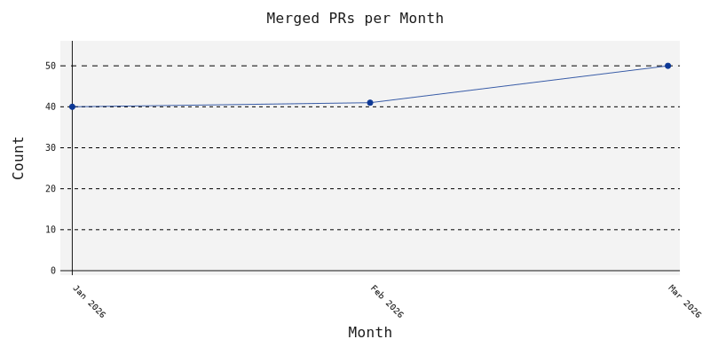
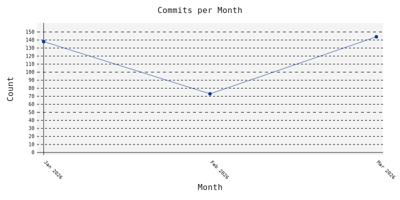
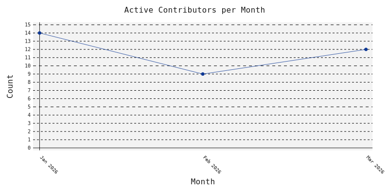

+++
type = "blog"
title = 'March 2026 Monthly Development Update'
date = 2026-03-15
+++

This month focuses on strengthening TLC’s core model checking engine, improving toolchain integration, and clarifying the project’s migration path away from the Toolbox. Highlights include major liveness and ENABLED soundness fixes, bundling the TLA+ formatter directly into tla2tools.jar, expanded documentation and diagnostics for automated workflows, and coordinated updates across the VS Code extension, TLAPM, Apalache, and the examples repository.

<!-- add hand-written highlights here -->

## Development Updates

Summaries of merged pull requests (and significant issues or releases) for
each project this month.

- TLC: Extends the XML exporter schema with explicit documentation and enumeration of built-in operators and runs it over all `tlaplus/examples` specs as a regression test, improving robustness for downstream tools that consume XML output ([#1324](https://github.com/tlaplus/tlaplus/pull/1324)).

- TLC: Adds a prominent deprecation notice to the Toolbox welcome page and release notes, directing users toward the actively maintained VS Code extension, Cursor integration, and command-line TLC, along with a migration guide ([#1339](https://github.com/tlaplus/tlaplus/pull/1339)).

- TLC: Fixes a subtle ENABLED soundness bug involving Java-overridden operators and INSTANCE substitution, preventing incorrect boolean results when primed variables appear under substitutions ([#1342](https://github.com/tlaplus/tlaplus/pull/1342)).

- TLC: Corrects TLCRuntime architecture detection by switching from x86/x86_64 to BIT_32/BIT_64, so REPL and TLC correctly report and handle non-x86 platforms such as ARM ([#1345](https://github.com/tlaplus/tlaplus/pull/1345)).

- TLC: Expands the README usage section and adds `USE.md` to document how to use TLA+ tools from GUIs, as Java libraries, and via standard machine-readable outputs, making it easier to integrate TLC into other applications and workflows ([#1340](https://github.com/tlaplus/tlaplus/pull/1340)).

- TLC: Fixes a liveness-checking bug where TLC could report a bogus finite-prefix safety counterexample without checking PossibleErrorModel conditions, ensuring only genuine violations are reported when fairness and tableau conditions are involved ([#1348](https://github.com/tlaplus/tlaplus/pull/1348)).

- TLC: Switches liveness operator argument handling to lazy evaluation in `Liveness.java`, improving support for properties defined via parameterized operators in instantiated modules and avoiding incorrect evaluation of state-level expressions ([#1350](https://github.com/tlaplus/tlaplus/pull/1350)).

- TLC: Integrates the TLA+ formatter directly into `tla2tools.jar`, so users and tooling can access formatting alongside SANY and TLC without relying on a separate formatter repository or web components ([#1347](https://github.com/tlaplus/tlaplus/pull/1347)).

- TLC: Defers warnings about missing SPEC or fairness when checking PROPERTIES until liveness analysis can classify violations, eliminating spurious warnings when all violations are pure safety issues ([#1351](https://github.com/tlaplus/tlaplus/pull/1351)).

- TLC: Adds `-suppressMessages` and `-warningsAsErrors` flags to SANY, enabling fine-grained control over which diagnostic codes are silenced or treated as hard failures in automated workflows ([#1344](https://github.com/tlaplus/tlaplus/pull/1344)).

- TLC: Ensures SANY only runs the linter after successful semantic analysis and level checking, preventing crashes when semantic analysis is skipped and preparing for future lints that depend on level information ([#1356](https://github.com/tlaplus/tlaplus/pull/1356)).

- TLC: Refines the XML exporter to avoid printing Java stack traces on parse failures, standardizing exit codes and relying on SANY's user-friendly error messages to improve UX for tools like TLAPM that use XMLExporter as their parser ([#1327](https://github.com/tlaplus/tlaplus/pull/1327)).

- TLC: Improves GitHub Actions security by removing some third-party actions and pinning the remaining ones to specific versions, reducing supply-chain risk in the build pipeline ([#1364](https://github.com/tlaplus/tlaplus/pull/1364)).

- TLC: Discontinues macOS code signing and notarization due to an expired certificate and developer account, advising users to manually whitelist the Toolbox or switch to VS Code or command-line TLC on macOS ([#1365](https://github.com/tlaplus/tlaplus/pull/1365)).

- TLC: Enhances error reporting so TLC explicitly identifies which temporal property is violated when liveness checking fails, making it easier to map counterexamples back to specific specifications ([#1355](https://github.com/tlaplus/tlaplus/pull/1355)).

- VSCode Extension: Fixes the MCP TLC tools so an explicitly provided `cfgFile` path is honored without falling back to naming-based discovery, enabling workflows with multiple configuration files per module ([#509](https://github.com/tlaplus/vscode-tlaplus/pull/509)).

- VSCode Extension: Updates the extension to use the formatter now bundled in `tla2tools.jar`, simplifying installation and ensuring consistent formatting behavior with the core TLA+ tools ([#510](https://github.com/tlaplus/vscode-tlaplus/pull/510)).

- TLAPM: Updates several example specifications to avoid identifier shadowing that SANY rejects, aligning TLAPM examples with the TLA+ language rules and ensuring they parse cleanly with SANY ([#251](https://github.com/tlaplus/tlapm/pull/251)).

- Examples: Adds `DieHardest.tla`, which composes two instances of the DieHarder spec using several parallel and interleaved self-composition strategies to compare jug configurations and illustrate how composition style affects BFS search behavior ([#199](https://github.com/tlaplus/Examples/pull/199)).

- Apalache: Releases Apalache 0.52.3 through 0.56.1 with new JSON-RPC capabilities such as `applyInOrder`, `compact`, a `STATE` query kind, and compression support, plus Quint `leadsTo` translation and fixes for LET-IN scoping and `UNCHANGED` inlining, improving performance and ergonomics for interactive and automated model exploration ([v0.56.1](https://github.com/apalache-mc/apalache/releases/tag/v0.56.1)).

<!--
Filtered items (editor: re-add if you disagree):
- [TLC] CONTRIBUTING.md: document git commit message format (https://github.com/tlaplus/tlaplus/pull/1341) — low-impact
- [TLC] Enhance CI workflows to support Windows environment.  (https://github.com/tlaplus/tlaplus/pull/1343) — testing
- [TLC] XML Exporter: add comprehensive documentation to schema file (https://github.com/tlaplus/tlaplus/pull/1346) — low-impact
- [TLC] CI: skip examples specs requiring Apalache (https://github.com/tlaplus/tlaplus/pull/1354) — testing
- [TLC] Improve security posture by eliminating some 3rd party GH actions and pinning others (https://github.com/tlaplus/tlaplus/pull/1364) — testing
- [Vscode Extension] Update formatter's url (https://github.com/tlaplus/vscode-tlaplus/pull/506) — low-impact
- [Vscode Extension] Tests: fix expected log message after SANY parse failure (https://github.com/tlaplus/vscode-tlaplus/pull/512) — testing
- [Vscode Extension] Update ci to match release workflow (https://github.com/tlaplus/vscode-tlaplus/pull/511) — testing
- [Community Modules] 202603110432 (https://github.com/tlaplus/CommunityModules/releases/tag/202603110432) — bot
- [Community Modules] Update GitHub Actions workflows to support multiple operating systems… (https://github.com/tlaplus/CommunityModules/pull/121) — testing
- [Examples] Fall back to Apalache v0.52.2 if latest download fails (https://github.com/tlaplus/Examples/pull/202) — testing
- [Examples] Change loop step from 'l' to '1' in pseudo code comment of Bakery.tla (https://github.com/tlaplus/Examples/pull/203) — low-impact
- [Apalache] v0.56.1 (https://github.com/apalache-mc/apalache/releases/tag/v0.56.1) — merged-into-latest
- [Apalache] v0.56.0 (https://github.com/apalache-mc/apalache/releases/tag/v0.56.0) — merged-into-latest
- [Apalache] v0.55.0 (https://github.com/apalache-mc/apalache/releases/tag/v0.55.0) — merged-into-latest
- [Apalache] v0.54.0 (https://github.com/apalache-mc/apalache/releases/tag/v0.54.0) — merged-into-latest
- [Apalache] v0.52.3 (https://github.com/apalache-mc/apalache/releases/tag/v0.52.3) — merged-into-latest
- [Apalache] Remove Nix from macOS integration-tests path; run directly (https://github.com/apalache-mc/apalache/pull/3279) — testing
- [Apalache] Fix a bug in Type1Lexer (https://github.com/apalache-mc/apalache/pull/3278) — merged-into-latest
- [Apalache] JSON-RPC server: add applyInOrder (https://github.com/apalache-mc/apalache/pull/3280) — merged-into-latest
- [Apalache] [release] 0.52.3 (https://github.com/apalache-mc/apalache/pull/3281) — merged-into-latest
- [Apalache] [release] 0.54.0 (https://github.com/apalache-mc/apalache/pull/3283) — merged-into-latest
- [Apalache] Add JSON-RPC method compact (https://github.com/apalache-mc/apalache/pull/3285) — merged-into-latest
- [Apalache] [release] 0.55.0 (https://github.com/apalache-mc/apalache/pull/3286) — merged-into-latest
- [Apalache] Update sbt, scripted-plugin to 1.12.6 (https://github.com/apalache-mc/apalache/pull/3277) — bot
- [Apalache] Update sbt-scalafix to 0.14.6 (https://github.com/apalache-mc/apalache/pull/3272) — bot
- [Apalache] Upgrade Jetty to 12.x (https://github.com/apalache-mc/apalache/pull/3289) — merged-into-latest
- [Apalache] Add kind STATE in query (https://github.com/apalache-mc/apalache/pull/3288) — merged-into-latest
- [Apalache] Add compression to the JSON-RPC server (https://github.com/apalache-mc/apalache/pull/3290) — merged-into-latest
- [Apalache] Update logback-classic, logback-core to 1.5.32 (https://github.com/apalache-mc/apalache/pull/3268) — bot
- [Apalache] Update jackson-module-scala to 2.20.2 (https://github.com/apalache-mc/apalache/pull/3251) — bot
- [Apalache] Update scalafmt-core to 3.10.7 (https://github.com/apalache-mc/apalache/pull/3265) — bot
- [Apalache] [release] 0.56.0 (https://github.com/apalache-mc/apalache/pull/3291) — merged-into-latest
- [Apalache] Add `leadsTo` conversion and fix bug in `setBy` transpilation (https://github.com/apalache-mc/apalache/pull/3294) — merged-into-latest
- [Apalache] Properly inline definitions in UNCHANGED (https://github.com/apalache-mc/apalache/pull/3295) — merged-into-latest
- [Apalache] Update sbt, scripted-plugin to 1.12.7 (https://github.com/apalache-mc/apalache/pull/3296) — bot
- [Apalache] [release] 0.56.1 (https://github.com/apalache-mc/apalache/pull/3297) — merged-into-latest
- [Apalache] Update sbt, scripted-plugin to 1.12.8 (https://github.com/apalache-mc/apalache/pull/3298) — bot
-->

### By the Numbers

| Metric                        | Jan 2026 | Feb 2026 | Mar 2026 |

| ----------------------------- | -----------: | -----------: | -----------: |

| Open issues                   | 48 | 51 | 674 |

| Merged pull requests          | 40 | 41 | 50 |

| Commits                       | 138 | 73 | 144 |

| Active contributors           | 14 | 9 | 12 |

| New contributors              | 3 | 2 | 1 |

| Google Group messages          | 32 | 31 | 40 |

| Tool runs (TLC)               | 263941 | 97573 | 209261 |

> Tool usage stats are opt-in and anonymized; actual usage is likely higher.
> Source: [metabase.tlapl.us](https://metabase.tlapl.us/public/dashboard/cf7e1a79-19b6-4be1-88bf-0a3fd5aa0dec).

### Community & Events

- A short thread on ["Describing unless condition in lisp"](https://discuss.tlapl.us/msg06687.html) explores how to express TLA+’s `UNLESS` construct in Lisp-like syntax.

- In ["In SANY, what is the APSubstInNode AST node used for?"](https://discuss.tlapl.us/msg06676.html), contributors clarify the role of `APSubstInNode` in the TLA+ parser’s abstract syntax tree.

- The Outreach Committee invites community members to join its next meeting in ["Join us at the next TLA+ Outreach Committee meeting on January 15, 11am Pacific Time"](https://discuss.tlapl.us/msg06684.html).

- The thread ["Leader backs up followers quickly with persistance"](https://discuss.tlapl.us/msg06686.html) discusses modeling persistent leader–follower replication and performance trade-offs in TLA+.

- In ["Model network using set or bag"](https://discuss.tlapl.us/msg06689.html), practitioners debate how best to represent network messages (sets vs. bags) and the implications for fairness and model checking.

- The post ["Request for review?"](https://discuss.tlapl.us/msg06677.html) gathers feedback on a user’s specification, highlighting common modeling patterns and pitfalls.

- ["Stuttering: abstraction vs. implementation"](https://discuss.tlapl.us/msg06708.html) revisits how stuttering steps relate refinement mappings between abstract and concrete specs.

- A new project, ["TLX — TLA+ specifications in Elixir syntax, with TLC integration"](https://discuss.tlapl.us/msg06712.html), introduces an Elixir-based syntax layer for TLA+ with direct model checking support.

- The thread ["Using TLA+ to Fix a Very Difficult glibc Bug - Malte Skarupke - C++Now 2025"](https://discuss.tlapl.us/msg06675.html) shares and briefly discusses a talk on applying TLA+ to diagnose a subtle glibc issue.

- In ["What is the plan for Distributed PlusCal?"](https://discuss.tlapl.us/msg06673.html), community members ask about and discuss the roadmap for Distributed PlusCal support.

- The TLA+ Foundation announces its [Grant Program Call for Proposals](https://foundation.tlapl.us/grants/2024-grant-program/index.html), offering USD $1,000–$100,000 for projects that advance TLA+ in research and industry.

- Newly funded projects are listed on the [Grant Recipients](https://foundation.tlapl.us/grants/grant-recipients/index.html) page, highlighting work selected for its potential impact on TLA+ technology and the community.

