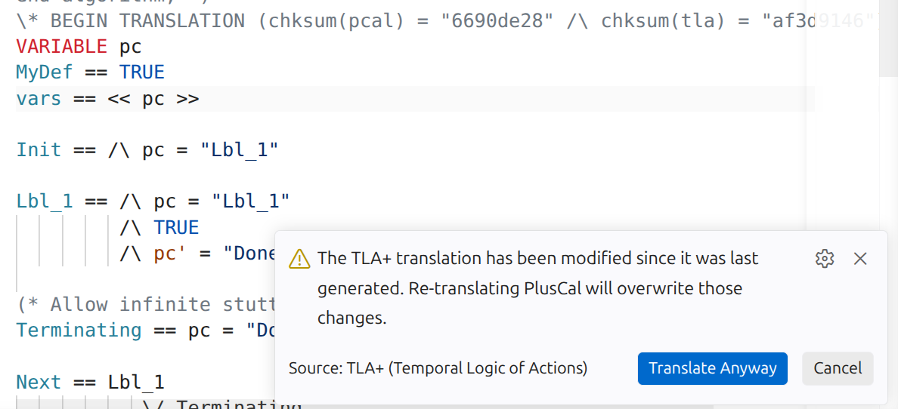
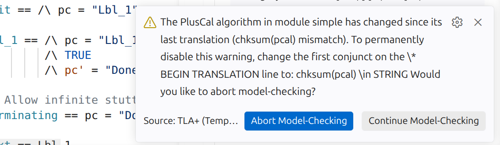
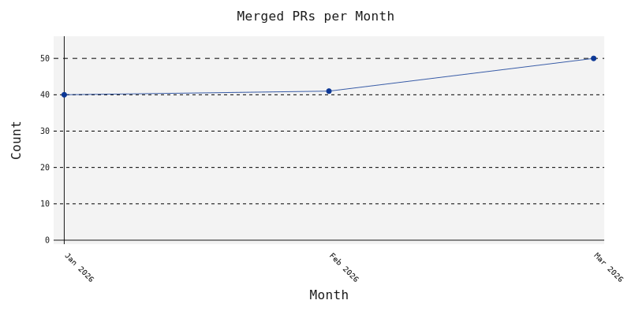
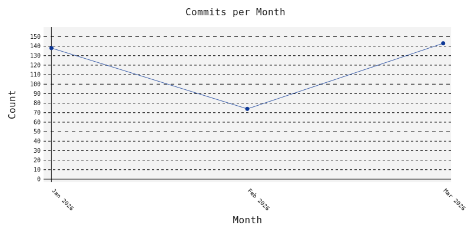
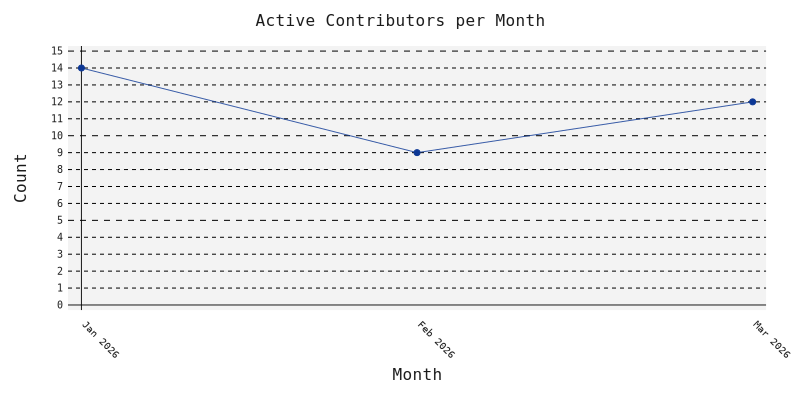

+++
type = "blog"
title = 'Q1 2026 Quarterly Development Update'
date = 2026-04-21
+++

This quarter focused on hardening verification correctness, deepening debugger support, and tightening integration across the TLA+ toolchain. TLC received several critical soundness and completeness fixes, including repairs to FcnLambdaValue handling, ENABLED semantics, bogus safety counterexamples, and truncated trace reads that could previously yield silent wrong results, alongside a new interactive debugger, trace replay, and ARM64-native builds. The VS Code extension, Apalache, TLAPM, and the examples and community modules all advanced in parallel, with integrated formatting, richer trace visualizations, improved JSON-RPC workflows, and an active community exploring liveness, refinement, and real-world modeling patterns.

<!-- add hand-written highlights here -->
## Soundness and completeness fixes in TLC

This quarter saw an unusually large batch of soundness and completeness fixes
land in TLC, most of them tracked from [#1332](https://github.com/tlaplus/tlaplus/issues/1332).
Several had been latent for years and could, in the worst case, cause TLC to
silently miss property violations or report bogus counter-examples. Users are
encouraged to re-run their models against the fixed release.

If you're using the [VSCode](https://marketplace.visualstudio.com/items?itemName=tlaplus.vscode-ide) extension, you're always running the latest version of TLC.

This is the list of resolved issues:
- [#1302](https://github.com/tlaplus/tlaplus/issues/1302): `FcnLambdaValue#toFcnRcd` mutated `excepts`, corrupting fingerprints and causing both missed and bogus safety/liveness violations (latent since ~2011).
- [#1145](https://github.com/tlaplus/tlaplus/issues/1145): `FcnLambdaValue.toTuple()` dropped `EXCEPT` overrides when a lazy function was coerced to a tuple (e.g. via `SubSeq`).
- [#1348](https://github.com/tlaplus/tlaplus/issues/1348): liveness checking reported bogus safety counter-examples by short-circuiting on accepting tableau nodes without checking the negated property's `PossibleErrorModel`.
- [#742](https://github.com/tlaplus/tlaplus/issues/742): universally-quantified `WF`/`SF` conjuncts spuriously failed with "temporal formula is a tautology".
- [#725](https://github.com/tlaplus/tlaplus/issues/725): fairness in instantiated submodules referencing primed variables via `SelectSeq`/`LAMBDA` failed with "undefined identifier".
- [#1112](https://github.com/tlaplus/tlaplus/issues/1112): `DiskFPSet` could stall indefinitely after a duplicate-fingerprint warning on long-running checks.

## TLA+ Debugger: Interactive State-Space Exploration

The TLA+ Debugger gained interactive state-space exploration: instead of
waiting for TLC to find a violation, you can now drive your spec by hand —
pick an initial state, choose any successor produced by `Next`, and step
backward to any earlier state. Combined with Watch expressions on an
animation module's `AnimView` operator, this turns the debugger into a
graphical debugger for your protocol, where each state is rendered as an
SVG you can navigate through.

A few capabilities make this practical for real debugging sessions:

- Conditional breakpoints on `Init`/`Next` (e.g. `~ENABLED Next` to halt at
  deadlocks), and halting even when `Next` is `FALSE`.
- Watch and Debug expressions can now load any module on the TLA-Library
  path, so you can export the current trace mid-session as JSON, TLA+,
  GraphViz, TLC binary, or a replayable trace expression — without
  preconfiguring the run or forcing a violation.
- Step-in / step-over pick "close" vs "far" successors via Hamming distance,
  and finite stuttering is preserved for faithful behavior replay.

This is the first step toward [#860](https://github.com/tlaplus/tlaplus/issues/860):
craft interesting traces interactively, export them, and have TLC re-verify
them against the spec as it evolves.

For the full write-up by Markus Kuppe, see the [Reddit announcement](https://www.reddit.com/r/tlaplus/comments/1q7vhod/tla_debugger_interactive_statespace_exploration/),
and watch [Interactive State-Space Exploration & Graphical Debugging with Animations](https://www.youtube.com/watch?v=ZrzoIYjFeHE)
for a demo.

## Detecting PlusCal/TLA+ divergence before translating

The VS Code extension now detects when the TLA+ inside a `BEGIN/END
TRANSLATION` block has been edited by hand since the last PlusCal
translation, and warns you before silently overwriting your changes.
On `TLA+: Parse Module`, SANY runs first and a checksum mismatch surfaces
a confirmation dialog so you can choose to keep your edits or re-translate.

Conversely, if the PlusCal source has changed and you start model checking
without re-translating, the extension now flags the stale TLA+ translation:

## Development Updates

Summaries of merged pull requests (and significant issues or releases) for
each project this quarter.

- TLC: Adds interactive state-space navigation in the debugger, letting users choose specific successor states and backtrack to any earlier state, including initial states, for more controlled exploration of behaviors ([#1270](https://github.com/tlaplus/tlaplus/pull/1270)). <!-- author: lemmy -->

- TLC: Introduces debugger breakpoints on `Init` and `Next` that halt when `Next` is `FALSE` or a breakpoint condition on `Init` holds, making it easier to stop exactly where a behavior becomes stuck or violates an assumption ([#1275](https://github.com/tlaplus/tlaplus/pull/1275)). <!-- author: lemmy -->

- TLC: Adds debug expressions to serialize the current trace in multiple formats and refactors spec-processing so trace dumping and debugging can reuse resolved modules, enabling richer trace tooling without changing normal runtime semantics ([#1274](https://github.com/tlaplus/tlaplus/pull/1274)). <!-- author: lemmy -->

- TLC: Fixes debugger expression evaluation for scoped identifiers and operator arguments so watch expressions and debug console input now respect local scopes and parameters, avoiding incorrect lookups reported in earlier debugger sessions ([#1278](https://github.com/tlaplus/tlaplus/pull/1278), [#1279](https://github.com/tlaplus/tlaplus/pull/1279)). <!-- author: lemmy -->

- TLC: Extends the debugger call stack in BFS mode to expose the full state trace, aligning BFS debugging with simulation mode so users can select arbitrary states in the trace when evaluating watch expressions ([#1280](https://github.com/tlaplus/tlaplus/pull/1280)). <!-- author: lemmy -->

- TLC: Adds ARM64 build targets and release artifacts for macOS and Linux, allowing Apple Silicon and ARM64 Linux users to run TLC and the Toolbox natively instead of relying on x86 emulation ([#1271](https://github.com/tlaplus/tlaplus/pull/1271), [#1281](https://github.com/tlaplus/tlaplus/pull/1281)). <!-- author: donghao1393 -->

- TLC: Standardizes PlusCal translation-hash mismatch warnings by routing them through SANY’s `Errors` infrastructure, improving consistency of divergence diagnostics and making them easier to consume programmatically ([#1215](https://github.com/tlaplus/tlaplus/pull/1215)). <!-- author: ahelwer -->

- TLC: Makes multi-process (MP) output formatting thread-safe by replacing shared `SimpleDateFormat` and `DecimalFormat` instances with safe alternatives, eliminating data races in concurrent TLC output while preserving existing timestamp and number formats ([#1267](https://github.com/tlaplus/tlaplus/pull/1267)). <!-- author: younes-io -->

- TLC: Propagates SANY parse and semantic errors for breakpoint, watch, and debug expressions directly to the debugger frontend, so invalid expressions now surface as clear user-facing diagnostics instead of silent log messages ([#1282](https://github.com/tlaplus/tlaplus/pull/1282)). <!-- author: lemmy -->

- TLC: Adds `-loadTrace` to replay traces previously written with `-dumpTrace`, and later allows `-loadTrace` and `-dumpTrace` to be combined so TLC can act as a one-shot trace post-processing or conversion tool; trace formats now support subsets of variables for more flexible replay workflows ([#1285](https://github.com/tlaplus/tlaplus/pull/1285), [#1289](https://github.com/tlaplus/tlaplus/pull/1289), [#1297](https://github.com/tlaplus/tlaplus/pull/1297)). <!-- author: lemmy -->

- TLC: Adds explicit warnings about debugger limitations when multiple TLC workers are used, clarifying that breakpoints and trace introspection may only apply to a single worker in parallel runs ([#1290](https://github.com/tlaplus/tlaplus/pull/1290)). <!-- author: lemmy -->

- TLC: Fixes XML export for `CASE OTHER` so the generated XML conforms to `sany.xsd`, preventing schema violations when specs use `CASE ... OTHER` constructs ([#1292](https://github.com/tlaplus/tlaplus/pull/1292)). <!-- author: younes-io -->

- TLC: Replaces `System.exit` calls in SANY and the XML exporter with exceptions, allowing these components to be embedded as libraries without terminating the hosting JVM on parse or export errors ([#1300](https://github.com/tlaplus/tlaplus/pull/1300)). <!-- author: lemmy -->

- TLC: Removes the RMI dependency from `FPSet` by dropping `UnicastRemoteObject` inheritance, improving compatibility with CheerpJ and other environments that lack native RMI support while only affecting already-deprecated distributed TLC paths ([#1301](https://github.com/tlaplus/tlaplus/pull/1301)). <!-- author: FedericoPonzi -->

- TLC: Fixes multiple soundness and completeness bugs involving `FcnLambdaValue` conversions, including incorrect mutation of `excepts`, crashes, and wrong results when checking liveness or safety, and adds regression tests to guard against future regressions ([#1304](https://github.com/tlaplus/tlaplus/pull/1304), [#1316](https://github.com/tlaplus/tlaplus/pull/1316), [#1322](https://github.com/tlaplus/tlaplus/pull/1322), [#1333](https://github.com/tlaplus/tlaplus/pull/1333)). <!-- author: lemmy -->

- TLC: Fixes handling of part-of-module `.cfg` files on Windows so configuration files that share a base name with their modules no longer cause errors on that platform ([#1317](https://github.com/tlaplus/tlaplus/pull/1317)). <!-- author: lemmy -->

- TLC: Extends the XML exporter and SANY to expose additional semantic information needed by TLAPM, including unencoded decimal values, proof levels, `LOCAL` tags, and `EXTENDS` clauses, and enumerates built-in operator names in the XML schema with richer documentation ([#1314](https://github.com/tlaplus/tlaplus/pull/1314), [#1307](https://github.com/tlaplus/tlaplus/pull/1307), [#1308](https://github.com/tlaplus/tlaplus/pull/1308), [#1309](https://github.com/tlaplus/tlaplus/pull/1309), [#1324](https://github.com/tlaplus/tlaplus/pull/1324), [#1346](https://github.com/tlaplus/tlaplus/pull/1346)). <!-- author: ahelwer -->

- TLC: Adds direct support for `x' \subseteq S` in specifications and ENABLED expressions, enabling efficient handling of subset constraints in next-state relations without requiring user-defined encodings ([#1287](https://github.com/tlaplus/tlaplus/pull/1287)). <!-- author: ahelwer -->

- TLC: Introduces a `SanySettings` API and updates XML export to skip PlusCal validation and optional analyses when requested, while ensuring linting only runs after successful semantic and level checking to avoid crashes in partial-analysis modes ([#1305](https://github.com/tlaplus/tlaplus/pull/1305), [#1356](https://github.com/tlaplus/tlaplus/pull/1356)). <!-- author: ahelwer -->

- TLC: Improves configuration processing by correctly handling `LazyValue` and `LetInNode` in `SPECIFICATION` and `PROPERTY` declarations, allowing temporal formulas to flow through parameterized operators and LET/IN constructs, and by permitting variables to appear as `PROPERTY` definitions when used as degenerate actions ([#1321](https://github.com/tlaplus/tlaplus/pull/1321), [#1329](https://github.com/tlaplus/tlaplus/pull/1329), [#1323](https://github.com/tlaplus/tlaplus/pull/1323)). <!-- author: lemmy -->

- TLC: Fixes a crash when using `@Evaluation`-annotated operators as constant substitutes and resolves a bogus error that claimed a constant was substituted with a non-constant, improving robustness of advanced constant-configuration patterns ([#1110](https://github.com/tlaplus/tlaplus/pull/1110), [#1330](https://github.com/tlaplus/tlaplus/pull/1330)). <!-- author: lemmy -->

- TLC: Adds JPF-based verification to the GitHub Actions PR workflow and enhances CI to run on Windows, increasing automated coverage across platforms and catching Java-level issues earlier in development ([#1334](https://github.com/tlaplus/tlaplus/pull/1334), [#1343](https://github.com/tlaplus/tlaplus/pull/1343)). <!-- author: lemmy -->

- TLC: Fixes `BufferedDataInputStream#readString` so truncated streams now correctly raise `EOFException` instead of returning NUL-padded partial strings, preventing silent data corruption when reading serialized TLC data ([#1335](https://github.com/tlaplus/tlaplus/pull/1335)). <!-- author: lemmy -->

- TLC: Enumerates SANY and XML exporter exit codes in dedicated classes and updates XMLExporter to print only SANY’s user-friendly parse errors instead of Java stack traces, improving integration with external tools and command-line UX ([#1319](https://github.com/tlaplus/tlaplus/pull/1319), [#1327](https://github.com/tlaplus/tlaplus/pull/1327)). <!-- author: ahelwer -->

- TLC: Migrates Maven snapshot publishing to Sonatype’s Central Publisher Portal and improves GitHub Actions security by pinning or removing third-party actions, tightening the project’s supply-chain posture ([#1312](https://github.com/tlaplus/tlaplus/pull/1312), [#1364](https://github.com/tlaplus/tlaplus/pull/1364)). <!-- author: FedericoPonzi -->

- TLC: Switches the rolling-release versioning scheme to calendar versioning (`YYYY.MM.DD.HHmmss`), clearly separating it from the 2.x maintenance branch and making build timestamps explicit in version numbers ([#1328](https://github.com/tlaplus/tlaplus/pull/1328)). <!-- author: lemmy -->

- TLC: Updates `TLCRuntime` to report 32-bit vs 64-bit architectures instead of x86-specific names, fixing incorrect architecture detection on ARM systems and simplifying downstream logic ([#1345](https://github.com/tlaplus/tlaplus/pull/1345)). <!-- author: lemmy -->

- TLC: Adds a deprecation notice to the Toolbox welcome page and release notes that points users to the actively maintained VS Code / Cursor extensions and CLI tooling, and expands README/USE documentation for using TLC as a library or via standard formats ([#1339](https://github.com/tlaplus/tlaplus/pull/1339), [#1340](https://github.com/tlaplus/tlaplus/pull/1340)). <!-- author: lemmy -->

- TLC: Improves liveness checking by fixing bogus safety counterexamples, implementing lazy evaluation of operator arguments in `Liveness.java`, deferring certain configuration warnings until properties are classified as safety or liveness, and showing which temporal property is violated in counterexamples ([#1348](https://github.com/tlaplus/tlaplus/pull/1348), [#1350](https://github.com/tlaplus/tlaplus/pull/1350), [#1351](https://github.com/tlaplus/tlaplus/pull/1351), [#1355](https://github.com/tlaplus/tlaplus/pull/1355)). <!-- author: lemmy -->

- TLC: Adds fine-grained SANY CLI flags `-suppressMessages` and `-warningsAsErrors` so users and tools can selectively silence or promote specific diagnostics to errors, enabling stricter pipelines without patching SANY itself ([#1344](https://github.com/tlaplus/tlaplus/pull/1344)). <!-- author: craft095 -->

- TLC: Integrates the TLA+ formatter into `tla2tools.jar`, making formatting available alongside SANY and TLC without a separate binary and updating the build and tests (including Windows support) accordingly ([#1347](https://github.com/tlaplus/tlaplus/pull/1347)). <!-- author: FedericoPonzi -->

- TLC: Fixes a subtle ENABLED soundness bug involving INSTANCE substitutions and Java operator overrides by correcting how primed variables are resolved under `Context.branch`, and adds regression tests to capture the failure mode ([#1342](https://github.com/tlaplus/tlaplus/pull/1342)). <!-- author: lemmy -->

- TLC: Discontinues macOS code signing and notarization due to expired certificates, documenting that users must now manually whitelist the Toolbox or prefer the VS Code / Cursor workflows on macOS ([#1365](https://github.com/tlaplus/tlaplus/pull/1365)). <!-- author: lemmy -->

- Vscode Extension: Implements interactive state-space navigation in the debugger UI, allowing users to select successor states and backtrack through traces in sync with the new TLC backend capabilities ([#475](https://github.com/tlaplus/vscode-tlaplus/pull/475)). <!-- author: lemmy -->

- Vscode Extension: Expands the animation guide with the `AnimWatch` operator and a shared `AnimDoc` abstraction, updating all six real-world examples to a consistent `AnimView`/`AnimDoc`/`AnimAlias`/`AnimWatch` pattern that clarifies when to use interactive debugging versus screencast-style animations ([#478](https://github.com/tlaplus/vscode-tlaplus/pull/478)). <!-- author: lemmy -->

- Vscode Extension: Restores the `>>` navigation control in the model-checking panel so users can jump directly from counterexample steps to the corresponding actions in the source, improving trace navigation ([#481](https://github.com/tlaplus/vscode-tlaplus/pull/481)). <!-- author: FedericoPonzi -->

- Vscode Extension: Adds automatic counterexample replay using TLC’s `-dumpTrace`/`-loadTrace` integration, so safety and liveness violations can be reloaded and debugged in seconds without re-running the model checker, even for very large state spaces ([#484](https://github.com/tlaplus/vscode-tlaplus/pull/484)). <!-- author: lemmy -->

- Vscode Extension: Introduces a dedicated output channel for the MCP server, surfacing logs, errors, and the server URL in one place so users can inspect MCP behavior and reuse the server outside VS Code or Cursor if desired ([#487](https://github.com/tlaplus/vscode-tlaplus/pull/487)). <!-- author: lemmy -->

- Vscode Extension: Improves robustness of TLC integration by fixing filename variable substitution in custom options, handling `STARTMSG` lines without severity suffixes, rejecting missing TLC input files early, and correcting deleted-value handling and sequence diff alignment in the model-checking UI ([#486](https://github.com/tlaplus/vscode-tlaplus/pull/486), [#489](https://github.com/tlaplus/vscode-tlaplus/pull/489), [#490](https://github.com/tlaplus/vscode-tlaplus/pull/490), [#491](https://github.com/tlaplus/vscode-tlaplus/pull/491), [#493](https://github.com/tlaplus/vscode-tlaplus/pull/493)). <!-- author: lemmy -->

- Vscode Extension: Hardens model and config resolution so custom runs can pick embedded `.tla` configs, and refines artifact naming and Windows CI expectations to make model selection deterministic across platforms ([#495](https://github.com/tlaplus/vscode-tlaplus/pull/495)). <!-- author: younes-io -->

- Vscode Extension: Adds built-in support for the TLA+ formatter (now shipped in `tla2tools.jar`), including fixes for specs that `EXTENDS CommunityModules`, formatter version updates, and configuration so the extension uses the integrated formatter by default while validating AST preservation after each run ([#327](https://github.com/tlaplus/vscode-tlaplus/pull/327), [#496](https://github.com/tlaplus/vscode-tlaplus/pull/496), [#497](https://github.com/tlaplus/vscode-tlaplus/pull/497), [#510](https://github.com/tlaplus/vscode-tlaplus/pull/510), [#506](https://github.com/tlaplus/vscode-tlaplus/pull/506)). <!-- author: FedericoPonzi -->

- Vscode Extension: Adds a feature to generate PlantUML sequence diagrams from TLC error traces by parsing the `trace` variable and emitting `.puml` files, making it easier to visualize protocol behaviors with existing PlantUML tooling ([#498](https://github.com/tlaplus/vscode-tlaplus/pull/498)). <!-- author: fschmole -->

- Vscode Extension: Fixes MCP TLC tools to honor an explicit `cfgFile` parameter instead of re-running config discovery, enabling workflows with multiple `.cfg` files per module and aligning MCP behavior with standard TLC usage ([#509](https://github.com/tlaplus/vscode-tlaplus/pull/509)). <!-- author: lemmy -->

- TLAPM: Updates example specifications to avoid identifier shadowing that SANY rejects, aligning TLAPM’s examples with the stricter parser and preventing parse failures when checked with the standard toolchain ([#251](https://github.com/tlaplus/tlapm/pull/251)). <!-- author: ahelwer -->

- Community Modules: Adds several new theorems about folds on functions and sequences, including results about how `FoldLeft` and `FoldRight` interact with sequence concatenation, and adjusts Graphs/Relations syntax to avoid tuple bindings that TLAPS does not support ([#118](https://github.com/tlaplus/CommunityModules/pull/118), [#119](https://github.com/tlaplus/CommunityModules/pull/119), [#120](https://github.com/tlaplus/CommunityModules/pull/120)). <!-- author: muenchnerkindl -->

- Examples: Expands the animation catalog with refined formatting for EWD998 and new animated specifications for the Tower of Hanoi and sliding puzzles, demonstrating how to build rich SVG-based visualizations for classic problems ([#193](https://github.com/tlaplus/Examples/pull/193), [#194](https://github.com/tlaplus/Examples/pull/194), [#195](https://github.com/tlaplus/Examples/pull/195)). <!-- author: lemmy -->

- Examples: Fixes a failing proof in the ByzPaxos example, adds a new “dag-based consensus” specification, introduces DieHardest.tla to compare jug configurations via parallel and interleaved self-composition, and corrects a typo in the Bakery algorithm pseudo-code comment ([#197](https://github.com/tlaplus/Examples/pull/197), [#198](https://github.com/tlaplus/Examples/pull/198), [#199](https://github.com/tlaplus/Examples/pull/199), [#203](https://github.com/tlaplus/Examples/pull/203)). <!-- author: muenchnerkindl -->

- Examples: Adjusts dependencies by logically reverting the use of Fork-based function libraries after their removal from TLAPM and adds a fallback to Apalache v0.52.2 in the Apalache download helper, improving resilience when fetching the latest Apalache release fails ([#196](https://github.com/tlaplus/Examples/pull/196), [#202](https://github.com/tlaplus/Examples/pull/202)). <!-- author: lemmy -->

- Apalache: Releases v0.52.2, v0.52.3, v0.54.0, v0.55.0, and v0.56.0–v0.56.1 with a focus on JSON-RPC improvements (new `applyInOrder`, `compact`, `STATE` query kind, and compression), Jetty 12 upgrades, better UNCHANGED inlining, Quint `leadsTo` support, and bug fixes in the lexer and printers; the latest release notes are in [v0.56.1](https://github.com/apalache-mc/apalache/releases/tag/v0.56.1). <!-- author: coffeeinprogress -->

- Apalache: Makes `Variants.tla` compatible with TLC by redefining variants as functions over singleton domains and adds TLC integration tests, ensuring Apalache-generated specs using variants can be checked consistently with TLC ([#3255](https://github.com/apalache-mc/apalache/pull/3255)). <!-- author: konnov -->

- Apalache: Extends the JSON-RPC exploration server with `applyInOrder`, `compact`, and a `STATE` query kind, plus gzip and Zstandard compression, reducing client round-trips and payload sizes for complex symbolic explorations ([#3280](https://github.com/apalache-mc/apalache/pull/3280), [#3285](https://github.com/apalache-mc/apalache/pull/3285), [#3288](https://github.com/apalache-mc/apalache/pull/3288), [#3290](https://github.com/apalache-mc/apalache/pull/3290)). <!-- author: konnov -->

- Apalache: Adds Quint-to-TLA+ conversion support for `leadsTo`, fixes a LET/IN-related bug in `setBy` transpilation, and properly inlines nullary operators in `UNCHANGED`, addressing subtle correctness issues in translated specs ([#3294](https://github.com/apalache-mc/apalache/pull/3294), [#3295](https://github.com/apalache-mc/apalache/pull/3295)). <!-- author: bugarela -->

<!--
Filtered items (editor: re-add if you disagree):
- [TLC] Fix explain.tlapl.us root 404 with index page (https://github.com/tlaplus/tlaplus/pull/1294) — low-impact
- [TLC] Upload tla2tools.jar as separate artifact in PR workflow. (https://github.com/tlaplus/tlaplus/pull/1298) — testing
- [TLC] simulate crash: java.lang.ClassCastException: TupleValue cannot be cast to class FcnRcdValue (https://github.com/tlaplus/tlaplus/pull/1322) — testing
- [TLC]  Ignore flaky DumpLoadTraceTest AliasSub auto-worker tests; add AliasSub2 tests. (https://github.com/tlaplus/tlaplus/pull/1326) — testing
- [TLC] Add JPF verification to GitHub Actions PR.yml workflow (https://github.com/tlaplus/tlaplus/pull/1334) — testing
- [TLC] CI: skip examples specs requiring Apalache (https://github.com/tlaplus/tlaplus/pull/1354) — testing
- [TLC] Improve security posture by eliminating some 3rd party GH actions and pinning others (https://github.com/tlaplus/tlaplus/pull/1364) — testing
- [Vscode Extension] Tests: fix expected log message after SANY parse failure (https://github.com/tlaplus/vscode-tlaplus/pull/512) — testing
- [Vscode Extension] Update ci to match release workflow (https://github.com/tlaplus/vscode-tlaplus/pull/511) — testing
- [Community Modules] Update GitHub Actions workflows to support multiple operating systems… (https://github.com/tlaplus/CommunityModules/pull/121) — testing
- [Examples] Fall back to Apalache v0.52.2 if latest download fails (https://github.com/tlaplus/Examples/pull/202) — testing
- [Apalache] v0.52.2 (https://github.com/apalache-mc/apalache/releases/tag/v0.52.2) — merged-into-latest
- [Apalache] v0.56.1 (https://github.com/apalache-mc/apalache/releases/tag/v0.56.1) — merged-into-latest
- [Apalache] v0.56.0 (https://github.com/apalache-mc/apalache/releases/tag/v0.56.0) — merged-into-latest
- [Apalache] v0.55.0 (https://github.com/apalache-mc/apalache/releases/tag/v0.55.0) — merged-into-latest
- [Apalache] v0.54.0 (https://github.com/apalache-mc/apalache/releases/tag/v0.54.0) — merged-into-latest
- [Apalache] v0.52.3 (https://github.com/apalache-mc/apalache/releases/tag/v0.52.3) — merged-into-latest
- [Apalache] [release] 0.52.2 (https://github.com/apalache-mc/apalache/pull/3257) — dep-update
- [Apalache] Fix a bug in Type1Lexer (https://github.com/apalache-mc/apalache/pull/3278) — merged-into-latest
- [Apalache] JSON-RPC server: add applyInOrder (https://github.com/apalache-mc/apalache/pull/3280) — merged-into-latest
- [Apalache] [release] 0.52.3 (https://github.com/apalache-mc/apalache/pull/3281) — dep-update
- [Apalache] [release] 0.54.0 (https://github.com/apalache-mc/apalache/pull/3283) — dep-update
- [Apalache] Add JSON-RPC method compact (https://github.com/apalache-mc/apalache/pull/3285) — merged-into-latest
- [Apalache] [release] 0.55.0 (https://github.com/apalache-mc/apalache/pull/3286) — dep-update
- [Apalache] Upgrade Jetty to 12.x (https://github.com/apalache-mc/apalache/pull/3289) — merged-into-latest
- [Apalache] Add kind STATE in query (https://github.com/apalache-mc/apalache/pull/3288) — merged-into-latest
- [Apalache] Add compression to the JSON-RPC server (https://github.com/apalache-mc/apalache/pull/3290) — merged-into-latest
- [Apalache] [release] 0.56.0 (https://github.com/apalache-mc/apalache/pull/3291) — dep-update
- [Apalache] [release] 0.56.1 (https://github.com/apalache-mc/apalache/pull/3297) — dep-update
- [TLC] CONTRIBUTING.md: document git commit message format (https://github.com/tlaplus/tlaplus/pull/1341) — low-impact
- [TLC] XML Exporter: add comprehensive documentation to schema file (https://github.com/tlaplus/tlaplus/pull/1346) — low-impact
- [Examples] Fall back to Apalache v0.52.2 if latest download fails (https://github.com/tlaplus/Examples/pull/202) — testing
-->

### By the Numbers

| Metric                        | Jan 2026 | Feb 2026 | Mar 2026 |

| ----------------------------- | -----------: | -----------: | -----------: |

| Open issues                   | 48 | 51 | 53 |

| Merged pull requests          | 40 | 41 | 50 |

| Commits                       | 138 | 74 | 143 |

| Active contributors           | 14 | 9 | 12 |

| New contributors              | 3 | 2 | 1 |

| Google Group messages          | 32 | 31 | 40 |

| Tool runs (TLC)               | 263941 | 97573 | 209261 |

> Tool usage stats are opt-in and anonymized; actual usage is likely higher.
> Source: [metabase.tlapl.us](https://metabase.tlapl.us/public/dashboard/cf7e1a79-19b6-4be1-88bf-0a3fd5aa0dec).

### Community & Events

- The [abridged summary of the tlaplus mailing list](https://discuss.tlapl.us/msg06624.html) highlights one notable update from the email community.

- A thread on [checking if a set is a singleton](https://discuss.tlapl.us/msg06626.html) clarifies idiomatic TLA+ patterns for expressing and proving singleton properties.

- The discussion on [constant operators and refinements](https://discuss.tlapl.us/msg06637.html) examines how constants behave under refinement mappings.

- A user shared their [experience proving liveness with TLAPS](https://discuss.tlapl.us/msg06610.html), including practical tips and current limitations.

- The [font dependency specification](https://discuss.tlapl.us/msg06614.html) thread documents how TLA+ tools depend on system fonts and how to configure them.

- A question on whether [ENABLED P is always stuttering-insensitive](https://discuss.tlapl.us/msg06630.html) led to a nuanced explanation of ENABLED and stuttering semantics.

- The Outreach Committee invited community members to the [January 15 TLA+ Outreach Committee meeting](https://discuss.tlapl.us/msg06621.html) to discuss ecosystem and education initiatives.

- A modeling advice thread on [capturing safety properties](https://discuss.tlapl.us/msg06634.html) shares patterns for structuring specs so that safety is easy to state and check.

- The [presentation for the next community meeting](https://discuss.tlapl.us/msg06618.html) thread coordinated talk topics and materials for an upcoming gathering.

- The announcement for the [TLA+ Community Meeting 2026](https://discuss.tlapl.us/msg06633.html) shares date, format, and participation details.

- A new [TLA+ Debugger for interactive state-space exploration](https://discuss.tlapl.us/msg06620.html) was introduced, enabling stepwise inspection of TLC runs.

- The [TypeOK for primed variables](https://discuss.tlapl.us/msg06622.html) discussion explains how to write invariants that correctly constrain next-state values.

- A post on [verified spec transpilation with Claude](https://discuss.tlapl.us/msg06635.html) explores using AI tools to transform TLA+ specifications while preserving meaning.

- A thread comparing [\subseteq vs \in SUBSET](https://discuss.tlapl.us/msg06611.html) clarifies semantic and stylistic differences between the two set operators.

- A PlusCal-focused thread on [adding raw TLA+ to process states](https://discuss.tlapl.us/msg06660.html) shows how to mix PlusCal and TLA+ for more expressive specs.

- The [AgentSkills call for contributions](https://discuss.tlapl.us/msg06642.html) invites reusable skill definitions for AI tools that work with TLA+.

- A discussion of a [discarded prototype TLA+ syntax using @ in proofs](https://discuss.tlapl.us/msg06657.html) gives historical context on proof-language design choices.

- A practical thread on [avoiding *.tlc dump files](https://discuss.tlapl.us/msg06667.html) explains how to configure TLC’s checkpointing and output.

- The launch of [tlabyexample.com](https://discuss.tlapl.us/msg06649.html) provides a growing collection of small, focused TLA+ examples for learners.

- Another announcement for the [January 15 Outreach Committee meeting](https://discuss.tlapl.us/msg06646.html) reiterates how to join and contribute agenda items.

- A post on [module instantiation semantics](https://discuss.tlapl.us/msg06643.html) clarifies how INSTANCE, parameters, and renaming behave in TLA+.

- The [performance when using tuples](https://discuss.tlapl.us/msg06654.html) thread reports on TLC performance characteristics and modeling trade-offs with tuples.

- A discussion on [practical applications of absolute fairness](https://discuss.tlapl.us/msg06647.html) examines when strong fairness assumptions are realistic in software models.

- A user debugging a [TLC error in the Bounded FIFO example](https://discuss.tlapl.us/msg06644.html) receives guidance on configuration and spec interpretation.

- A second announcement for the [TLA+ Community Meeting 2026](https://discuss.tlapl.us/msg06656.html) provides updated logistics and participation info.

- The thread on [plans for Distributed PlusCal](https://discuss.tlapl.us/msg06671.html) discusses the current status and possible future directions of the language extension.

- A post on [describing an unless condition in Lisp](https://discuss.tlapl.us/msg06687.html) connects temporal reasoning in TLA+ with constructs in Lisp-based tooling.

- A SANY internals question about the [APSubstInNode AST node](https://discuss.tlapl.us/msg06676.html) sheds light on how the parser represents substitutions.

- A later [Outreach Committee meeting thread](https://discuss.tlapl.us/msg06684.html) follows up with notes and ongoing opportunities to get involved.

- The [“Leader backs up followers quickly with persistence”](https://discuss.tlapl.us/msg06686.html) thread discusses a replicated log design and its TLA+ model.

- A popular thread on [modeling a network using a set or a bag](https://discuss.tlapl.us/msg06689.html) compares different abstractions for messages and channels.

- In [“Request for review?”](https://discuss.tlapl.us/msg06677.html), a community member receives detailed feedback on a nontrivial specification.

- The [stuttering: abstraction vs. implementation](https://discuss.tlapl.us/msg06708.html) discussion clarifies how stuttering steps relate refinement levels.

- The [TLX project](https://discuss.tlapl.us/msg06712.html) introduces writing TLA+ specifications in Elixir syntax with TLC integration.

- A thread on [using TLA+ to fix a difficult glibc bug](https://discuss.tlapl.us/msg06675.html) highlights Malte Skarupke’s C++Now 2025 talk and its lessons.

- A follow-up on the [plan for Distributed PlusCal](https://discuss.tlapl.us/msg06673.html) continues the discussion on roadmap and community needs.

- The [2024 Grant Program call for proposals](https://foundation.tlapl.us/grants/2024-grant-program/index.html) invites projects seeking USD $1,000–$100,000 to advance TLA+ in research and industry.

- The Foundation also announced new [grant recipients](https://foundation.tlapl.us/grants/grant-recipients/index.html) whose projects aim to improve TLA+ technology and benefit the broader community.

---

Part of this post was generated using AI.
